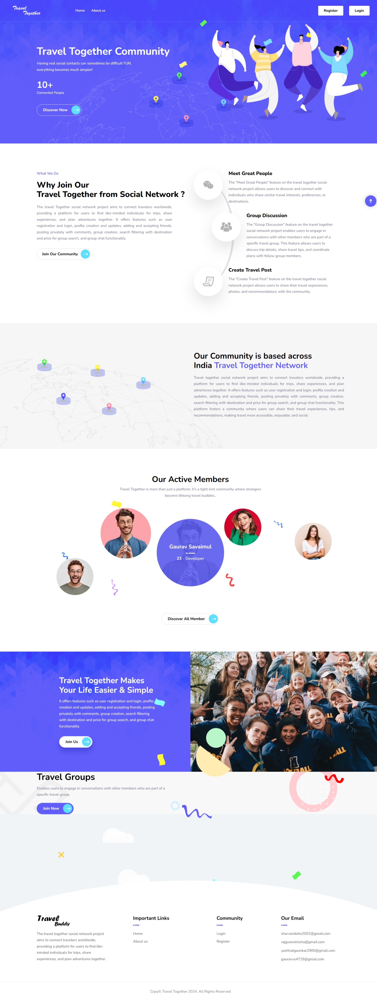

# 🌍 Travel Together A Travel Mate Finder System

## ✨ Overview
Our project is an innovative web-based social media platform designed to inspire and connect travelers worldwide. It enables users to share their travel experiences, discover new destinations, and engage with a vibrant community of like-minded adventurers. With features such as group chats, destination-based forums, and personalized recommendations, the platform fosters meaningful connections, encourages exploration, and enhances the overall travel experience.

## 🚀 Key Features
- **📸 User Content Sharing** – Share travel stories, reviews, and media.
- **💬 Community Interaction** – Connect via forums, groups, and chats.
- **🎯 Personalized Suggestions** – Get tailored travel recommendations.
- **📊 Real-Time Insights** – Act on user feedback instantly.
- **⚡ Fast & Cost-Effective Analytics** – Gain valuable travel insights.

## 🛠️ Tech Stack Used

| Component                 | Technologies                                      |
|---------------------------|--------------------------------------------------|
| 🎨 **Front-End**         | HTML, CSS, JavaScript, Bootstrap                |
| ⚙️ **Back-End**        | PHP                                              |
| 🗄️ **Database**        | MySQL    |
| 🌐 **Server & Env.**   | XAMPP, phpMyAdmin              |
| 📌 **Frameworks & Libs**| Bootstrap for responsive UI                      |
| 🔄 **Server-Side Scripting** | PHP for dynamic content and database interactions |

## 📸

